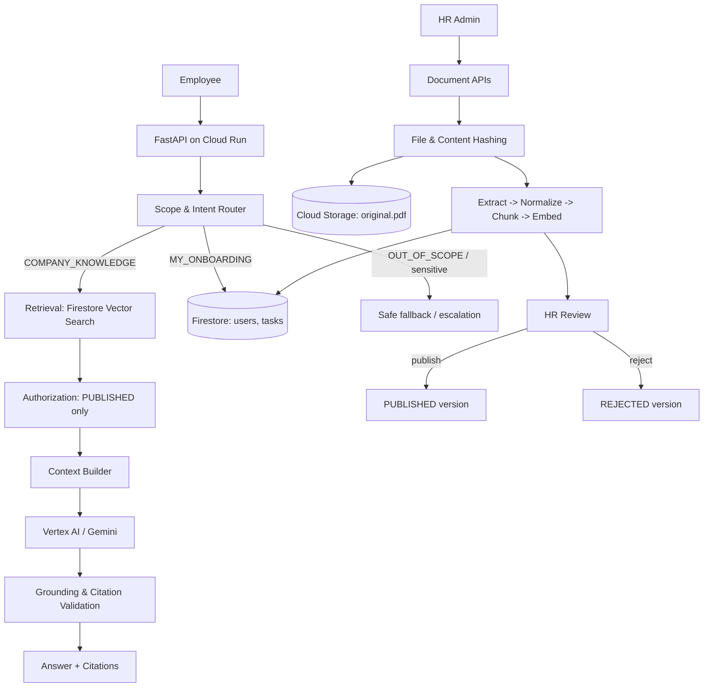

# DayOne AI — Backend

An AI onboarding copilot backend that helps new employees understand company
onboarding information and complete their onboarding tasks.

DayOne AI answers employee questions using **only** the company's published
onboarding documents, returns **citations**, never fabricates unsupported company
information, and personalizes onboarding tasks from an employee's role,
department, and location.

Built with **FastAPI**, **Firestore** (application data + MVP vector search),
**Cloud Storage** (original PDFs), and **Vertex AI / Gemini** (generation and
embeddings). Designed to run on **Google Cloud Run**.

---

## Table of Contents

- [Architecture](#architecture)
- [Capabilities](#capabilities)
- [Project Structure](#project-structure)
- [Getting Started](#getting-started)
- [Running Locally](#running-locally)
- [API Reference](#api-reference)
- [Document Lifecycle](#document-lifecycle)
- [RAG Contract](#rag-contract)
- [Security Model](#security-model)
- [Testing](#testing)
- [Deployment (Cloud Run)](#deployment-cloud-run)
- [Environment Variables](#environment-variables)
- [Offline / Local Fallback Mode](#offline--local-fallback-mode)
- [Out of Scope](#out-of-scope)

---

## Architecture



---

## Capabilities

| Area | Capability |
|---|---|
| **Chat** | `POST /chat` — intent-routed answers with citations, safe fallback, and escalation. |
| **Company knowledge** | RAG over published chunks with vector search; citations include document, version, section, and page. |
| **Safe fallback** | Unsupported questions never hallucinate — they return a fixed fallback and set `escalation_required`. |
| **Document ingestion** | PDF upload → SHA-256 file hash → duplicate detection → extraction → normalization → content hash → heading-aware chunking → embeddings → Firestore. |
| **Document lifecycle** | Versioning with `DRAFT/PROCESSING/FAILED/REVIEW/REJECTED/PUBLISHED/SUPERSEDED`, HR review, publish, reject, supersede, audit logs. |
| **Duplicate detection** | Byte-identical file detection (file hash) and identical normalized content detection (content hash). |
| **Personalized onboarding** | Profile-driven task generation (role/department/location), task completion, progress, and next-action. |
| **Security** | Employees only retrieve `PUBLISHED` content and only their own onboarding data; sensitive requests are rejected. |
| **Evaluation** | Golden-question retrieval evaluation (Hit@K, MRR) and citation validation. |

---

## Project Structure

```text
hris/
├── app/
│   ├── main.py                     # FastAPI app, CORS, routers, /health
│   ├── config.py                   # Compatibility shim -> app/core/config.py
│   ├── api/
│   │   ├── chat.py                 # /chat (intent routing + RAG)
│   │   ├── documents.py            # /documents, /versions/{id}/process|publish|reject
│   │   ├── onboarding.py           # /profile, /onboarding/progress
│   │   └── tasks.py                # /tasks, /tasks/{id}/complete
│   ├── core/
│   │   ├── config.py               # Pydantic Settings
│   │   ├── security.py             # UserContext, get_current_user, require_hr_admin
│   │   └── errors.py               # Structured AppException hierarchy
│   ├── models/
│   │   ├── chat.py                 # ChatRequestV1 / ChatResponseV1 / Citation / IntentType
│   │   ├── document.py             # Document, versions, chunks, evaluation questions, audit logs
│   │   ├── onboarding.py           # UserProfile, OnboardingTask, progress
│   │   └── task.py                 # Re-exports task models (spec §8 layout)
│   ├── repositories/
│   │   ├── firestore.py            # Firestore + in-memory fallback
│   │   └── storage.py              # Cloud Storage + local fallback
│   └── services/
│       ├── gemini.py               # RAG engine (retrieval -> context -> Gemini)
│       ├── embeddings.py           # Vertex embeddings + deterministic offline fallback
│       ├── retrieval.py            # Vector search + context/citation building
│       ├── document_processor.py   # Ingestion pipeline
│       ├── router.py               # Scope & intent routing
│       ├── onboarding.py           # Profile, tasks, progress
│       ├── evaluation.py           # Retrieval evaluation (Hit@K) + citation validation
│       └── vertex_service.py       # Low-level Vertex Gemini client
├── tests/
│   ├── conftest.py                 # Shared fixtures + in-memory PDF builder
│   ├── unit/
│   │   └── test_document_processor.py
│   ├── integration/
│   │   ├── test_chat.py
│   │   ├── test_documents_api.py
│   │   ├── test_security.py
│   │   ├── test_offline_flows.py   # Offline flow coverage
│   │   └── test_e2e.py             # Full journey (LLM + cloud stubbed)
│   └── evaluation/
│       └── test_evaluation.py
├── Dockerfile
├── requirements.txt
├── .env.example
└── README.md
```

---

## Getting Started

### Prerequisites

- Python 3.11+ (developed and tested on 3.14)
- A Google Cloud project with the **Vertex AI API** enabled
  (`aiplatform.googleapis.com`), plus **Firestore** and **Cloud Storage**

### Install

```powershell
python -m venv .venv
.\.venv\Scripts\Activate.ps1
.\.venv\Scripts\python.exe -m pip install -r requirements.txt
```

### Configure

```powershell
Copy-Item .env.example .env
```

Edit `.env` with your project details. For local development without Google
Cloud, simply leave `GCP_PROJECT_ID` and `GCS_BUCKET_NAME` unset — the service
runs in an [offline fallback mode](#offline--local-fallback-mode).

### Authenticate to Google Cloud (when configured)

```bash
gcloud auth application-default login
```

or set `GOOGLE_APPLICATION_CREDENTIALS` to a service account key with the
**Vertex AI User** (`roles/aiplatform.user`) role.

---

## Running Locally

```powershell
.\.venv\Scripts\uvicorn app.main:app --reload --port 8000
```

- Base URL: `http://127.0.0.1:8000`
- Swagger UI: `http://127.0.0.1:8000/docs`
- ReDoc: `http://127.0.0.1:8000/redoc`
- Health: `http://127.0.0.1:8000/health`

All endpoints are served under **both** the root path and `/api/v1`
(e.g. `/chat` and `/api/v1/chat`).

---

## API Reference

### System

| Method | Path | Description |
|---|---|---|
| `GET` | `/health` | Health check — returns `{"status": "ok", ...}` |

### Chat

**`POST /chat`**

```bash
curl -X POST http://127.0.0.1:8000/api/v1/chat \
  -H "Content-Type: application/json" \
  -d '{"user_id": "user_001", "message": "How do I request a laptop?"}'
```

```json
{
  "answer": "You should submit a laptop request through the IT portal ...",
  "citations": [
    {
      "document_id": "laptop-request-procedure",
      "document_title": "Laptop Request Procedure",
      "version": "1.0",
      "section": "Request Process",
      "page": 1
    }
  ],
  "intent": "COMPANY_KNOWLEDGE",
  "grounded": true,
  "escalation_required": false
}
```

### Documents (HR admin)

| Method | Path | Description |
|---|---|---|
| `POST` | `/documents` | Create a logical document |
| `GET` | `/documents` | List documents (`?status=&department=&location=&document_type=`) |
| `GET` | `/documents/{document_id}` | Get document + versions |
| `POST` | `/documents/{document_id}/versions` | Upload a PDF as a new version |
| `POST` | `/versions/{version_id}/process` | Extract → chunk → embed → store |
| `GET` | `/versions/{version_id}/chunks` | List stored chunks |
| `GET` | `/versions/{version_id}/evaluation` | Run persisted golden questions against a version (Hit@K / MRR) |
| `POST` | `/versions/{version_id}/publish` | Publish (supersedes previous) |
| `POST` | `/versions/{version_id}/reject` | Reject a version |

HR endpoints require an HR context. Pass `X-Access-Level: HR_ADMIN`.

### Onboarding

| Method | Path | Description |
|---|---|---|
| `GET` | `/profile` | Get the employee profile |
| `PUT` | `/profile` | Update profile (name, role, department, location) |
| `GET` | `/tasks` | List personalized onboarding tasks |
| `POST` | `/tasks/{task_id}/complete` | Mark a task as completed |
| `GET` | `/onboarding/progress` | `{ total, completed, remaining, progress_percent }` |

Employee identity is taken from `X-User-Id` (defaults to `user_001`) plus
optional `X-User-Role`, `X-User-Department`, `X-User-Location`.

---

## Document Lifecycle

```text
UPLOAD ─► DUPLICATE CHECK ─┬─► REJECT (duplicate)
                           └─► PROCESSING ─► REVIEW ─┬─► PUBLISHED ─► SUPERSEDED
                                       │             └─► REJECTED
                                       └─► FAILED
```

Key rule: **Upload does not equal publish.** Employees can only retrieve
information from `PUBLISHED` versions.

---

## RAG Contract

```text
Question → Scope Gate → Intent Router → Authorization → Query Embedding
        → Firestore Vector Search (top-K) → Context Builder → Gemini
        → Grounding Validation → Citation Validation → Answer
```

- Heading-aware chunking (~800 tokens, ~100–150 token overlap).
- One embedding per chunk; `top-K` retrieval (default `K = 5`).
- Only chunks whose version is `PUBLISHED` are retrieved.
- Company-document answers always include citations.
- Insufficient evidence produces a fixed safe fallback.

---

## Security Model

Authorization is enforced by the backend — never delegated to the model:

1. Identify the user (`get_current_user`).
2. Determine authorization (e.g. `require_hr_admin`).
3. Filter retrieved data (`PUBLISHED` only; soft department/location scoping).
4. Build the Gemini context only from authorized information.
5. Validate citations before returning.

Employees may access published company documentation, their own profile, and
their own tasks. Sensitive requests (e.g. another person's salary) are rejected
and flagged for escalation.

---

## Testing

```powershell
.\.venv\Scripts\python.exe -m pytest -q
```

Tests are grouped as:

- `tests/unit/` — pure logic and single services.
- `tests/integration/` — the FastAPI stack with **cloud and AI stubbed**
  (in-memory Firestore, local-disk storage, offline embeddings, stub LLM).
- `tests/evaluation/` — retrieval `Hit@5 >= 80%` and citation validation.

The suite covers chat routing (including general onboarding), document
ingestion, the document API lifecycle (REVIEW-gated publish, supersede),
duplicate detection, evaluation-question persistence and cross-version
regression, and security boundaries (unpublished/rejected content is never
retrievable, cross-user task access is forbidden, sensitive requests are
escalated). `tests/integration/test_e2e.py` runs the full HR→employee journey
end-to-end with no Google Cloud or AI calls.

---

## Deployment (Cloud Run)

```bash
# Build and push the container
gcloud builds submit --tag gcr.io/$GCP_PROJECT_ID/dayone-ai

# Deploy
gcloud run deploy dayone-ai \
  --image gcr.io/$GCP_PROJECT_ID/dayone-ai \
  --region $GCP_LOCATION \
  --allow-unauthenticated \
  --set-env-vars GCP_PROJECT_ID=$GCP_PROJECT_ID,GCP_LOCATION=$GCP_LOCATION,GCS_BUCKET_NAME=$GCS_BUCKET_NAME
```

The container:

- honors Cloud Run's `$PORT`,
- starts FastAPI with Uvicorn,
- writes logs to stdout/stderr,
- stores no persistent application data on the local filesystem
  (PDFs live in Cloud Storage).

---

## Environment Variables

| Variable | Purpose |
|---|---|
| `APP_NAME` | Application name |
| `ENVIRONMENT` / `APP_ENV` | Runtime environment |
| `LOG_LEVEL` | Logging level |
| `PORT`, `HOST` | Server binding |
| `GCP_PROJECT_ID` / `GOOGLE_CLOUD_PROJECT` | Google Cloud project |
| `GCP_LOCATION` / `GOOGLE_CLOUD_LOCATION` | Region |
| `GEMINI_MODEL` | Generation model |
| `EMBEDDING_MODEL` | Embedding model |
| `GCS_BUCKET_NAME` | Bucket for original PDFs |
| `FIRESTORE_DATABASE` | Firestore database name |
| `GOOGLE_APPLICATION_CREDENTIALS` | Optional service account key path |
| `LOCAL_STORAGE_DIR` | Local fallback storage directory |

Never commit real secrets. Use `.env` locally and Cloud Run env vars / Secret
Manager in production.

---

## Offline / Local Fallback Mode

When Google Cloud is not configured the service still runs end-to-end for local
development and tests:

- **Firestore** → in-memory store
- **Cloud Storage** → local disk (`LOCAL_STORAGE_DIR`)
- **Embeddings** → deterministic lexical feature-hashing vectors
- **Gemini** → retrieval-grounded extractive answer

This lets the full ingestion → publish → RAG → citation flow be exercised
without credentials.

---

## Out of Scope

Real HRIS integration, payroll, leave approval workflows, salary database, SSO,
native mobile apps, multi-company tenancy, GKE, Cloud SQL, BigQuery, Pub/Sub,
API Gateway, microservices, and complex autonomous agent frameworks.
